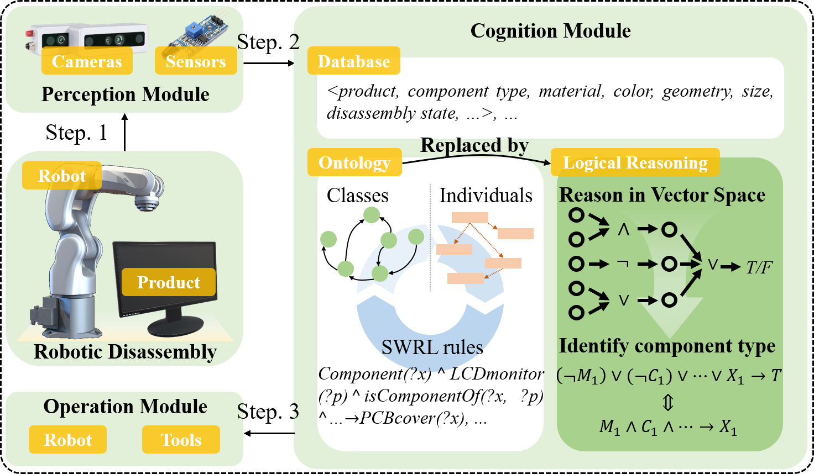

# Components Logical Reasoning

This repo is the official implementation of ...

## Update

***03/30/2025***

All the code, models and configs are provided. Don't hesitate to open an issue if you have any problem! 🙋🏻 

## Introduction

In this paper, we present a comprehensive approach for robotic disassembly using a logical reasoning framework that combines symbolic logic with deep learning. The proposed system replaces traditional ontology-based inference with a more adaptable logical reasoning module that utilizes BERT embeddings for text-based characteristic representation.


## Instructions

See [INSTRUCTIONS](INSTRUCTIONS.md) for more details about:
- Environment installation
- Dataset preparation
- Training and validation


##  Citation

If you find our work inspiring or use our codebase in your research, please consider giving a star ⭐ and a citation.

```latex
...
```

## License

...

## Acknowledgement

...
